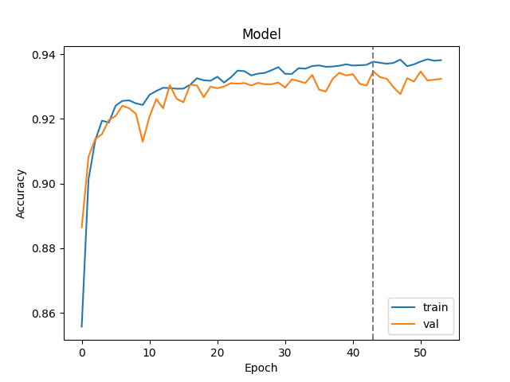

# Segmentação de Língua de Sinais utilizando Pose

Dado um vídeo de entrada onde uma pessoa está sinalizando em língua de sinais, a segmentação é a tarefa que consiste em dividir esse vídeo em *segmentos significativos*. Nesse trabalho, o segmento é definido como uma frase, ou seja, queremos encontrar no vídeo de entrada segmentos de vídeo que representem uma frase cada.

## Ambiente de execução

Esse repositório contém um `Dockerfile` com a descrição de um ambiente docker que faz a execução de todos os experimentos. No processamento foi utilizada uma placa de vídeo NVIDIA GeForce RTX 3050.

## Pré-processamento

Os dados de entrada consistem das estimativas de pose extraídas com OpenPose para cada frame de cada vídeo do dataset. O pré-processamento organiza os dados para treino e validação no formato `tfrecord` que contém os seguintes campos:
- `fps` (`Int64List`): framerate do vídeo
- `pose_data` (`BytesList`): estimativa de pose, em um tensor do formato `(frames, 1, keypoints, 2)`
-  `pose_confidence` (`BytesList`): confiança da estimativa de pose, em um tensor do formato `(frames, 1, keypoints)`
- `is_signing` (`BytesList`): indicação se a pessoa estava sinalizando (1) ou não (0) a cada frame

Os valores das coordenadas dos *keypoints* são normalizados em relação à resolução do vídeo.

Para o processamento do Public DGS Dataset:

`python3 ./preprocessing/build_tfrecord_train.py --skel <pasta-jsons-esqueleto> --type_skel DGS --annot <pasta-anotacoes-eaf> --fps 50 --output <pasta-output>`

Foram utilizados apenas as câmeras A e B do dataset, em que aparecem apenas uma pessoa por vez. Foram removidos do dataset os vídeos que não continham o tier correspondente no arquivo de anotação do ELAN (`Deutsche_Übersetzung_A` ou `Deutsche_Übersetzung_B` para as câmeras A e B, respectivamente).

O dado já processado pode ser baixado [nesse link](https://ufmgbr-my.sharepoint.com/:u:/g/personal/jessicalfr_ufmg_br/EYH2wSRK-SRFt0RWwLlWSAwB5IkzGeejgO2SU5ruBVRsEg?e=1GkHKF).

## Experimentos

### Distribuição dos dados

O dataset pré-processado contém 570 sequências de esqueletos extraídos dos vídeos, que foram divididos em 342 sequêndias para treino (60%), 114 sequências para validação (20%) e 114 sequências para teste (20%). Cada sequência contém, em média 6,8 minutos de duração a 50 fps.

A proporção de frames com label 1 (a pessoa está sinalizando) no dataset é dada pela tabela. Podemos ver que o dataset é balanceado.

**Dataset** | **Y=1 no total de frames** | **Média de Y=1 por sequência** | **Desvio padrão de Y=1 por sequência** |
--------|:-----:|:-----:|:-----:|
Treino  | 0,503 | 0,535 | 0,267 |
Dev     | 0,516 | 0,564 | 0,246 |
Teste   | 0,501 | 0,549 | 0,259 |
**Total**   | **0,506** | **0,543** | **0,261** |

### Arquitetura

A arquitetura utilizada se baseia no modelo de detecção de língua de sinais proposto por [Moryossef1 et al (2020)](https://slrtp.com/papers/full_papers/SLRTP.FP.04.017.paper.pdf). A ideia é avaliar o desempenho de um modelo de deteção em uma tarefa de segmentação, pois esses dois problemas são definidos de forma muito semelhante.

Dada a sequência de poses extraídas de um vídeo, calcula-se o *optical flow* do esqueleto a cada par de frames. O *optical flow F* para cada ponto *P* do esqueleto no tempo *t* é definido como a norma L2 do vetor resultante da diferença entre dois frames consecutivos:

$$ F(P)_t = ||P_t - P_{t-1}||_2 * fps $$

Caso um ponto *P* não seja identificado no frame *t*, o valor do *optical flow* é zero.

A sequência gerada pela extração do *optical flow* é dada como entrada a uma rede recorrente LSTM. Os experimentos realizados avaliaram modificações nos hiperparâmetros dessa rede.

*Adicionar figura da arquitetura aqui*

### Busca por hiperparâmetros

Os hiperparâmetros e respectivos valores avaliados são listados a seguir.

- Inputs do modelo: Apenas *keypoints* da pose, apenas das mãos, ou todos (pose, mãos e rosto).
- Taxa de dropout dos inputs: 0,1, 0,2, 0,3, 0,4 ou 0,5.
- Tipo da camada LSTM: unidirecional ou bidirecional.
- Tamanho da camada oculta no LSTM: 32, 64 ou 128 unidades.
- Taxa de aprendizado: 0,01, 0,001 ou 0,0001.

Foi utilizada a técnica de *random discrete grid search* para encontrar os melhores hiperparâmetros, sorteando 30 combinações dos valores possíveis. Os modelos foram treinados por 100 épocas, com tolerância de 10 épocas para *early stopping*. A acurácia na base de validação foi utilizada para avaliar o modelo a cada época.

### Resultados

A principal métrica utilizada foi a acurácia. Também foi calculada para a base de teste o *precision*, *recall* e *F1 score* de cada modelo. Os resultados das métricas de avaliação para todos os experimentos se encontram [aqui](https://docs.google.com/spreadsheets/d/1TRfizXqF6qu1dMrNDq354dbJPOnM9XjMhhxzA0osuIQ/edit?usp=sharing). Para reproduzir os resultados basta executar `python3 compute_metrics.py --dataset_path data/dgs_corpus.tfrecord`.

O modelo de maior acurácia na base de teste acerta a classificação do frame 92,84% das vezes. A arquitetura do modelo utiliza um LSTM bidirecional, com 64 unidades. Os *keypoints* de input são de pose, mãos e rosto, a taxa de dropout dos inputs é 0,1 e a taxa de aprendizado é 0,01. A acurácia do modelo ao longo das épocas é mostrada a seguir.

*Abaixo discutir os tipos de erro de segmentação no melhor modelo*
